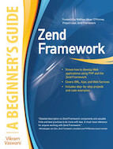

A disciplina de Programação Web 1 (PW1) do Curso Superior de Tecnologia de Sistemas para Internet do IFPB tem como objetivo apresentar ao aluno conceitos sobre desenvolvimento do Back-end de sistemas Web utilizando PHP e banco de dados. Sua carga horária apresenta um total de 83 horas aula e será ministrada pelo professor Luiz Carlos Chaves. Para as aulas serão utilizadas exposições e atividades práticas, além de avaliações individuais e em grupo.

## Conteúdo

A disciplina apresenta o seguinte [conteúdo](docs/CONTENT.md) que será dividido conforme este [roteiro de aula](docs/OUTLINE.md) e este [Google Classroom](https://classroom.google.com/u/2/c/MzEwNDY4MTA3MDJa).

## Avaliações

A nota final será computado através da média ponderada das três maiores avaliações:

* Avaliação I: [Prova - PHP Linguagem](exams/prova-php-lang.md);
* Avaliação II: [Prova - PHP Web](exams/prova-php-web.md);
* Avaliação III: [Blog](exams/blog.md);
* Avaliação IV (Projeto): [Especificação](exams/projeto-laravel.md).

Detalhe, a nota do projeto não poderá ser eliminada e atividades extras podem gerar pontuação extra.

## Comunicação

Toda a comunicação será realizada usando o  no channel `#pw1-20191`.

## Bibliografia

### Bibliografia Básica

    

### Bibliografia Complementar

      

<!-- Bibliografia Básica:

- Manual do PHP.  Disponível em: http://www.php.net/docs.php. Acesso em: 13 de março de 2019.
- Manula do Laravel Framework.  Disponível em: http://laravel.com/docs/. Acesso em: 13 de março de 2019.
- CURIOSO, Andrew. Expert PHP and MySQL. Indianápolis (USA): WILEY PUBLISHING, 2010. 587 p. il. ISBN 9780470563120.
- MCARTHUR, Kevin. Pro PHP: patterns, frameworks, testing and more. New York: Apress, 2008. 349 p. ISBN 9781590598191.
- MILETTO, Evandro Manara ; BERTAGNOLLI, Silvia de Castro (Org.). Desenvolvimento de software II: introdução ao desenvoilvimento WEB com HTML, CSS, Javascript e PHP. Porto Alegre: Bookman, 2014. 266 p. il. (Tekne).

Bibliografia Complementar:

- Composer. Disponível em: https://getcomposer.org/doc. Acesso em: 11 de março de 2019.
PHP Standards Recommendations (PSR). Disponível em: https://www.php-fig.org/psr. Acessado em: 11 de março de 2019.
- CÓRDULA, Rodrigo Beltrão de Lucena. PHP e Ajax: direto ao ponto. Rio de Janeiro: Ciência Moderna, 2014. 377 p. il. ISBN 9788539904716.
- PADILLA, Armando; HAWKINS, Tim. Pro PHP applocation performance: tuning PHP Web projects for maximum performance. New York: Apress, 2010. 244 p. il. ISBN 9781430228981.
- SNYDER, Chris; MYER, Thomas; SOUTHWELL, Michael. Pro PHP security: from application security principles to the implementation of XSS defenses. 2. ed. New York: Apress, 2010. 345 p. il. ISBN 9781430233183.
- VASWANI, Vikram. Zend Framework: a beginner´s guide. New York: McGraw-Hill, 2010. 446 p. il. (A Beginner´s Guide). ISBN 9780071639392.
- ZANDSTRA, Matt. Objetos PHP, padrões e prática. 2. ed. Rio de Janeiro: Alta Books, 2009. 456 p. il. ISBN 9788576082415. -->
